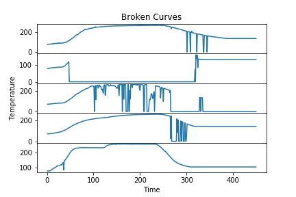
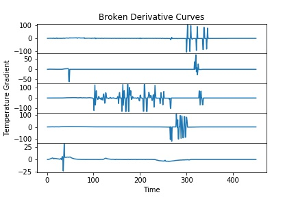
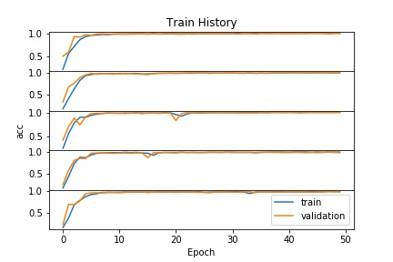
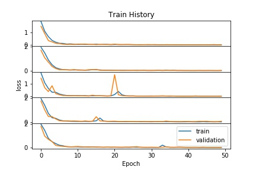
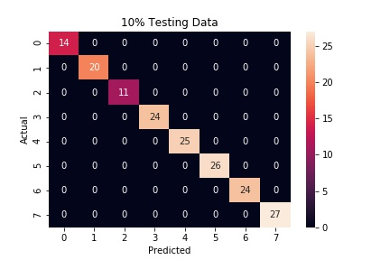
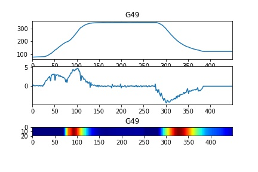
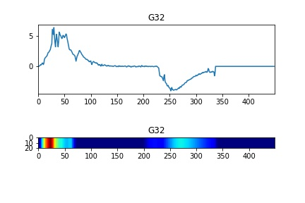

# 📊 AI-Powered Time-Series Classification  

This project applies a **1D Convolutional Neural Network (1D-CNN)** to classify **time-series data** from an industrial dataset.  
The model is trained to distinguish between different operational conditions, with a focus on **anomaly detection** and **predictive maintenance**.  

---

## 🚀 Project Overview  

- **Dataset**: Industrial sensor readings from **IMBD AI & Big Data Competition**  
- **Model**: 1D-CNN with **Conv1D**, **MaxPooling**, and **GlobalAveragePooling**  
- **Techniques**: K-Fold Cross-Validation, Data Augmentation, Grad-CAM for interpretability  
- **Competition Performance**: Achieved **99.8% average accuracy** in cross-validation, with an **official test accuracy of 99.0%**, ranking among the top solutions. 


---

## 📂 Project Structure  

| File/Folder             | Description                                      |
|-------------------------|--------------------------------------------------|
| 📂 src                 | Contains all core scripts                        |
| 📂 visualizations      | Stores generated plots & Grad-CAM heatmaps       |
| 📄 requirements.txt    | Python dependencies                              |
| 📄 README.md           | Project documentation                           |
| 📄 .gitignore          | Ignore unnecessary files                         |
| 📄 2019_IMBD_1D_CNN.ipynb | Main Jupyter Notebook |


---


## 🔬 Data Processing  

- **Dataset**: Sensor time-series data from **thubigdata2019training-230**  
- **Key Preprocessing Steps**:  
  - **Standardised time-series values** for consistency  
  - **Converted categorical labels to one-hot encoding**  
  - **Applied Min-Max Scaling** to normalise feature distributions  
  - **Removed invalid or missing records** (final dataset: **1,723 samples**)  
### 🛠 Handling Anomalies  
To improve model robustness, we analysed and visualised **anomalous curves** detected in the dataset:

| Broken Sensor Data | Derivative Curves (Anomalies) |
|------------------|------------------------------|
|  |  |

---

## 🏗 Model Architecture  

The model is a **1D-CNN** designed for time-series classification:  

```python
model = Sequential()
model.add(Reshape((X_train.shape[1], 1), input_shape=(X_train.shape[1],)))  
model.add(Conv1D(100, 10, activation='relu'))  
model.add(Conv1D(100, 10, activation='relu'))  
model.add(MaxPooling1D(3))  
model.add(Conv1D(160, 10, activation='relu'))  
model.add(Conv1D(160, 10, activation='relu'))  
model.add(GlobalAveragePooling1D())  
model.add(Dense(y_train.shape[1], activation='softmax'))
Conv1D Layers: Extract temporal patterns
MaxPooling: Downsampling for efficiency
GlobalAveragePooling: Feature compression
Softmax Output: Multi-class classification
```

---

## 🎯 Training Strategy  

- **Loss Function**: `categorical_crossentropy` (multi-class classification)  
- **Optimizer**: Adam  
- **K-Fold Cross-Validation**: 5-fold  
- **Training Setup**:  
  - `epochs=50`, `batch_size=100`  
  - **Best accuracy**: **100.0%**  
  - **Average accuracy**: **99.8%**  

### 📉 Training History
| Training Accuracy | Training Loss |
|------------------|--------------|
|  |  |


---
## 📈 Model Performance  

✅ **Confusion Matrix**: Evaluates classification accuracy across all classes  
✅ **Grad-CAM Heatmaps**: Highlights key areas influencing model decisions  


### Confusion Matrices  
| Training Set | Test Set |
|-------------|---------|
|  |  |

Example Code:  
```python
cm = confusion_matrix(y_true, y_pred)
sns.heatmap(cm, annot=True, fmt="d", cmap="Blues")
```
### 🔹 Grad-CAM Heatmaps  
Grad-CAM highlights which parts of the time-series input contribute most to the model’s decision.  
This allows us to **interpret model predictions** and detect **sensor failures** based on learned features.

| **Training Set Heatmap** | **Test Set Heatmap** |
|-------------------|-------------------|
|  |  |


---
## 🔥 Results & Key Findings  

📌 **Model Performance**:  
- **1D-CNN (Conv1D + MaxPooling + GlobalAvgPooling)**  
- **Achieved 99.8% average accuracy (Cross-Validation), with best accuracy reaching 100.0%**  
- **Official Test Accuracy (Competition Evaluation): 99.0%**  

📌 **Key Contributions**:
- **Optimised 1D-CNN architecture** by fine-tuning kernel sizes and pooling strategies
- **Implemented K-Fold Cross-Validation**, improving model generalisation
- **Developed Grad-CAM visualisation**, enhancing AI explainability for sensor failures
- **Refined preprocessing pipeline**, ensuring clean and standardised time-series input
  

📌 **Limitations & Future Directions**:  
- 🔹 **This project focused on 1D-CNN without comparing alternative architectures like LSTM or Transformers.**  
- 🔹 **Future work may explore Hybrid CNN-RNNs, Temporal CNNs, or Transformers for improved feature extraction & efficiency.**  
- 🔹**Investigate model quantisation (e.g., TensorFlow Lite, ONNX)** to optimise for real-time deployment.**  


---
## 🌍 Why It Matters  

AI-driven **time-series classification** is critical for **industrial anomaly detection & predictive maintenance**.  
This project demonstrates how deep learning can help:  
- 📉 **Reduce downtime** by predicting failures before they happen  
- 🏭 **Enhance efficiency** in manufacturing by monitoring sensor data  
- 🛠 **Improve reliability** of industrial systems through proactive diagnostics  
This approach can be applied to **smart manufacturing, energy monitoring, and IoT-based automation**.


